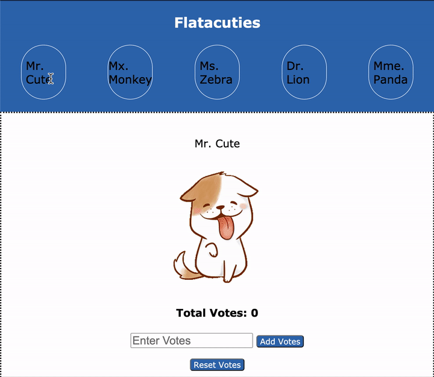

# Flatacalories

Today you'll be building an app for counting calories! You will be using a local
API and building out the frontend for our app, Flatacalories.

## Demo

Use this gif as an example of how the app should work.



> To view in VSCode, right click on the README.md file and select "Open Preview".

## Setup

Run this command to get the backend started:

```sh
json-server --watch db.json
```

Test your server by visiting this route in the browser:

[http://localhost:3000/characters](http://localhost:3000/characters)

Then, open the `index.html` file on your browser to run the application.

Write your code in the `src/index.js` file. The base URL for your API will be
[http://localhost:3000](http://localhost:3000).

## Deliverables

As a user, I can:

1. See all characters names in a `div` with the id of `"character-bar"`. Create
   a `span` tag with the character's name and add it the `div#character-bar`
   once you have retrieved the character data from the server. You will need to
   make a GET request to the following endpoint to retrieve the character data:

   ```txt
   GET /characters

   Example Response:
   [
    {
      "id": 1,
      "name": "Mr. Cute",
      "image": "https://thumbs.gfycat.com/EquatorialIckyCat-max-1mb.gif",
      "calories": 0
    },
    {
      "id": 2,
      "name": "Mr. Monkey",
      "image": "https://thumbs.gfycat.com/FatalInnocentAmericanshorthair-max-1mb.gif",
      "calories": 0
    },
    ...
   ]
   ```

2. When the character in the `div#character-bar` is clicked, display the
   character's details in the `div#detailed-info`. You can either use the
   character information from your first request, or make a new request to this
   endpoint to get the character's details:

   ```txt
   GET /characters/:id

   Example Response:
   {
    "id": 1,
    "name": "Mr. Cute",
    "image": "https://thumbs.gfycat.com/EquatorialIckyCat-max-1mb.gif",
    "calories": 0
   }
   ```

3. When the `form#calories-form` is submitted, add the number of calories from
   the input field to the character displayed in the `div#detailed-info`. **No
   persistence is needed**.
